# SparkSQL [databricks]

## Prerequisites

Before proceeding, ensure you have the following tools installed:

- Azure CLI (az) – Used to interact with Azure services and manage resources.
- Terraform – Infrastructure as Code (IaC) tool for provisioning Azure resources.

📘 Follow the full setup instructions for [Windows environment setup](./setup-windows.md)<br>
🍎 Follow the full setup instructions for [MacOS environment setup](./setup-macos.md)<br>
🐧 Follow the full setup instructions for [Ubuntu 24.10 environment setup](./setup-ubuntu.md)

📌 **Important Guidelines**
Please read the instructions carefully before proceeding. Follow these guidelines to avoid mistakes:

- If you see `<SOME_TEXT_HERE>`, you need to **replace this text and the brackets** with the appropriate value as described in the instructions.
- Follow the steps in order to ensure proper setup.
- Pay attention to **bolded notes**, warnings, or important highlights throughout the document.
- Clean Up Azure Resources Before Proceeding. Since you are using a **free-tier** Azure account, it’s crucial to clean up any leftover resources from previous lessons or deployments before proceeding. Free-tier accounts
have strict resource quotas, and exceeding these limits may cause deployment failures.

## 1. Create a Storage Account in Azure for Terraform State

Terraform requires a remote backend to store its state file. Follow these steps:

### **Option 1: Using Azure CLI [Recommended]**

1. **Authenticate with Azure CLI**

Run the following command to authenticate:

```bash
az login
```

💡 **Notes**:
- This will open a browser for authentication.
- If you have **multiple subscriptions**, you will be prompted to **choose one**.
- If you only have **one subscription**, it will be selected by default.
- **Please read the output carefully** to ensure you are using the correct subscription.

2. **Create a Resource Group:**

📌 **Important! Naming Rules for Azure Resources**

<details>
  <summary>👇<strong> Before proceeding, carefully review the naming rules to avoid deployment failures.</strong> 👇 [⬇️⬇️⬇️ Expand to see Naming Rules ⬇️⬇️⬇️]</summary>

### 📝 **Naming Rules for Azure Resources**
Before creating any resources, ensure that you follow **Azure's naming conventions** to avoid errors.

- **Resource names must follow specific character limits and allowed symbols** depending on the resource type.
- **Using unsupported special characters can cause deployment failures.**
- **Storage accounts, resource groups, and other Azure resources have different rules.**

🔹 **Common Rules Across Most Resources**:
- **Allowed characters:** Only **letters (A-Z, a-z)**, **numbers (0-9)**.
- **Case Sensitivity:** Most names are **lowercase only** (e.g., storage accounts).
- **Length Restrictions:** Vary by resource type (e.g., Storage accounts: **3-24 characters**).
- **No special symbols:** Avoid characters like `@`, `#`, `$`, `%`, `&`, `*`, `!`, etc.
- **Hyphens and underscores:** Some resources support them, but rules differ.

📖 **For complete naming rules, refer to the official documentation:**  
🔗 [Azure Naming Rules and Restrictions](https://learn.microsoft.com/en-us/azure/azure-resource-manager/management/resource-name-rules)

</details>

To create a Resource Group name run the command:

```bash
az group create --name <RESOURCE_GROUP_NAME> --location <AZURE_REGION>
```

3. **Create a Storage Account:**

⚠️  **Storage Account name, are globally unique, so you must choose a name that no other Azure user has already taken.** 

```bash
az storage account create --name <STORAGE_ACCOUNT_NAME> --resource-group <RESOURCE_GROUP_NAME> --location <AZURE_REGION> --sku Standard_LRS
```

4. **Create a Storage Container:**

```bash
az storage container create --name <CONTAINER_NAME> --account-name <STORAGE_ACCOUNT_NAME>
```

### **Option 2: Using Azure Portal (Web UI)**
1. **Log in to [Azure Portal](https://portal.azure.com/)**
2. Navigate to **Resource Groups** and click **Create**.
3. Enter a **Resource Group Name**, select a **Region**, and click **Review + Create**.
4. Once the Resource Group is created, go to **Storage Accounts** and click **Create**.
5. Fill in the required details:
   - **Storage Account Name**
   - **Resource Group** (Select the one you just created)
   - **Region** (Choose your preferred region)
   - **Performance**: Standard
   - **Redundancy**: Locally Redundant Storage (LRS)
6. Click **Review + Create** and then **Create**.
7. Once created, go to the **Storage Account** → **Data Storage** → **Containers** → Click **+ Container**.
8. Name it `tfstate`  (as example) and set **Access Level** to Private.
9. To get `<STORAGE_ACCOUNT_KEY>`: Navigate to your **Storage Account** →**Security & Networking** → **Access Keys**. Press `show` button on `key1`

## 2. Get Your Azure Subscription ID

### **Option 1: Using Azure Portal (Web UI)**

1. **Go to [Azure Portal](https://portal.azure.com/)**
2. Click on **Subscriptions** in the left-hand menu.
3. You will see a list of your subscriptions.
4. Choose the subscription you want to use and copy the **Subscription ID**.

### **Option 2: Using Azure CLI**

Retrieve it using Azure CLI:

```bash
az account show --query id --output tsv
```

## 3. Update Terraform Configuration

Navigate into folder `terraform`. Modify `main.tf` and replace placeholders with your actual values.

- Get a Storage Account Key (`<STORAGE_ACCOUNT_KEY>`):

```bash
az storage account keys list --resource-group <RESOURCE_GROUP_NAME> --account-name <STORAGE_ACCOUNT_NAME> --query "[0].value"
```

- **Edit the backend block in `main.tf`:**

```hcl
  terraform {
    backend "azurerm" {
      resource_group_name  = "<RESOURCE_GROUP_NAME>"
      storage_account_name = "<STORAGE_ACCOUNT_NAME>"
      container_name       = "<CONTAINER_NAME>"
      key                  = "<STORAGE_ACCOUNT_KEY>"
    }
  }
  provider "azurerm" {
    features {}
    subscription_id = "<SUBSCRIPTION_ID>"
  }
```

## 4. Deploy Infrastructure with Terraform

To start the deployment using Terraform scripts, you need to navigate to the `terraform` folder.

```bash
cd terraform/
```

Run the following Terraform commands:

```bash
terraform init
```  

```bash
terraform plan -out terraform.plan
```  

```bash
terraform apply terraform.plan
```  

To see the `<RESOURCE_GROUP_NAME_CREATED_BY_TERRAFORM>` (resource group that was created by terraform), run the command:

```bash
terraform output resource_group_name
```

## 5. Verify Resource Deployment in Azure

After Terraform completes, verify that resources were created:

1. **Go to the [Azure Portal](https://portal.azure.com/)**
2. Navigate to **Resource Groups** → **Find `<RESOURCE_GROUP_NAME_CREATED_BY_TERRAFORM>`**
3. Check that the resources (Storage Account, Databricks, etc.) are created.

Alternatively, check via CLI:

```bash
az resource list --resource-group <RESOURCE_GROUP_NAME_CREATED_BY_TERRAFORM> --output table
```

## 6. Launch notebooks on Databricks cluster

Follow the steps below to locate and access your Databricks workspace in the Azure Portal.

1. **Retrieve the Resource Group Name**

After running Terraform, you can find the resource group name by checking the Terraform output:

```bash
terraform output resource_group_name
```

Take note of this name for the next steps.

2. **Sign in to Azure Portal**

- Open your web browser and navigate to the Azure Portal: [https://portal.azure.com](https://portal.azure.com)
- Log in with your Azure credentials.

3. **Locate the Resource Group**

- In the Azure Portal, search for “Resource groups” in the top search bar.
- Click on Resource groups in the search results.
- Find the resource group from the Terraform output (e.g., `rg-<ENV>-<LOCATION>-<random_suffix>`).
- Click on the resource group name to open its details page.

4. **Find the Databricks Workspace**

- Inside the Resource Group, look for a resource with the Type: `Azure Databricks Service`.
- The Name of the Databricks workspace should be similar to: `dbw-<ENV>-<LOCATION>-<random_suffix>`
- Click on the Databricks workspace name.

5. **Launch Databricks**

- On the Databricks workspace overview page, locate the Launch Workspace button.
- Click Launch Workspace – this will redirect you to the Databricks portal.
- Sign in if prompted using your Azure credentials.

6. **Start Using Databricks**

Once inside the Databricks UI, you can create clusters, notebooks, and start working with your data.

- Open compute tab.
- Press `Create compute` button.
- Setting up the cluster settings: choose `Single Node`, in `Databricks Runtime Version` use basic preset (not ML), unset the `Use Photon Accseleration` then press the button `Create compute` (it will take some time 8-10 min).
- In compute in spark config create:
  fs.azure.account.key.stdevwesteuropexdpv.dfs.core.windows.net 
  "your_storage_account_key"
- Create notebooks, write code and launch them on created Databricks cluster


The pipeline successfully processed data through all three layers of the Medallion Architecture.

1. Bronze Layer (Raw Data Ingestion)
Source: Raw data was ingested from Azure Data Lake Storage (ADLS Gen2).

Security: Personally Identifiable Information (PII) such as user_id and address was encrypted using the AES-256 algorithm before being stored in Managed Delta Tables.

Screenshots:
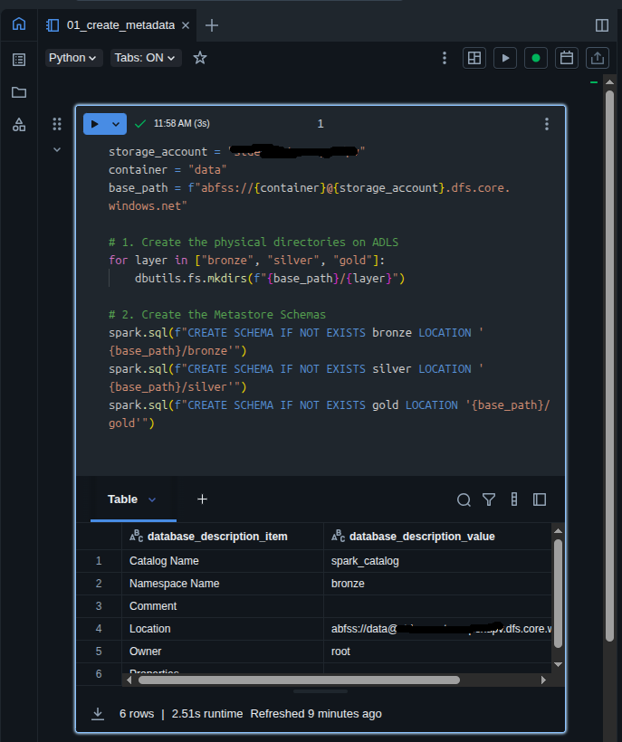
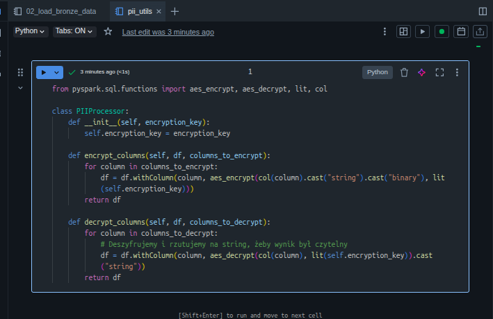
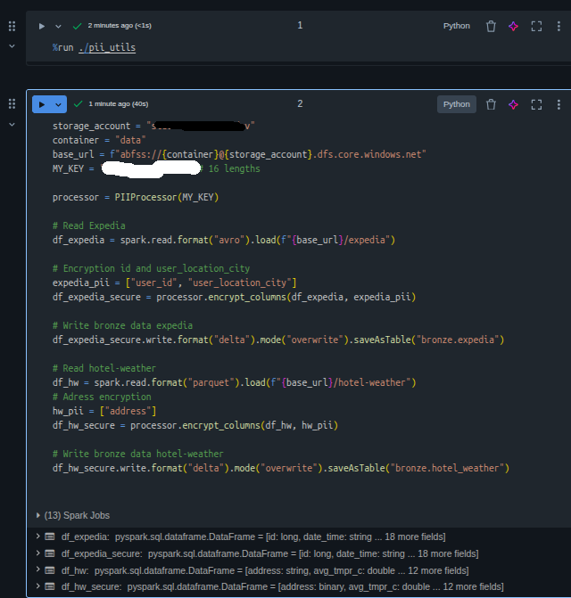
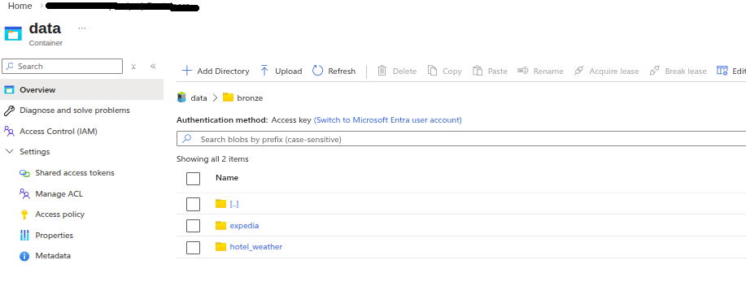

2. Silver Layer (Cleaned & Standardized)
Transformations: Data underwent cleaning, including white-space trimming, timestamp standardization, and duplicate removal.

Data Integrity: PII data remained encrypted to ensure compliance with security standards.

Screenshots:
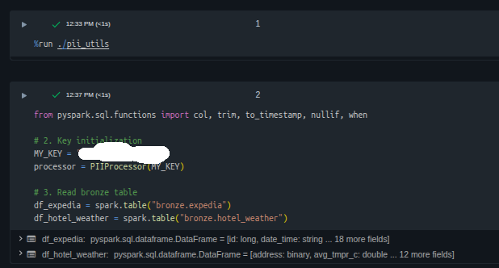
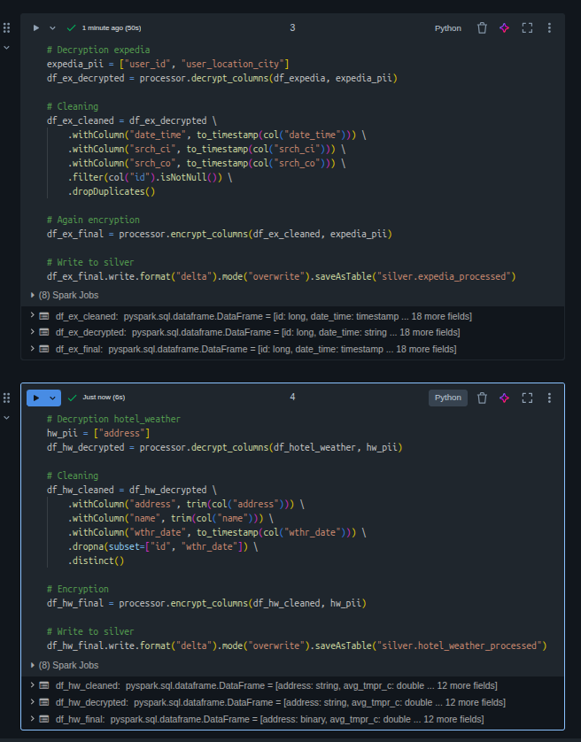
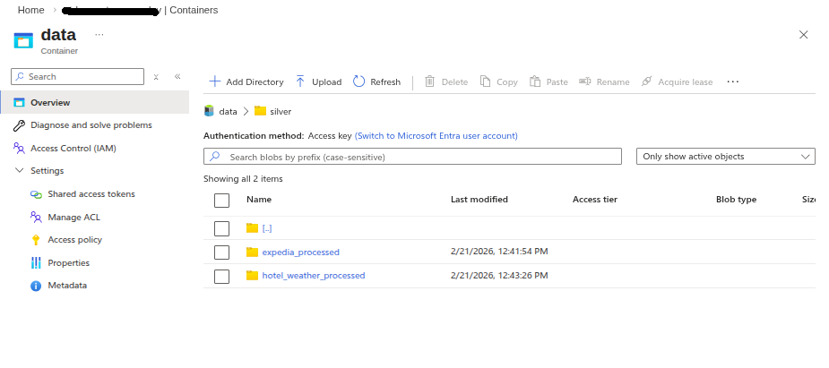

3. Gold Layer (Business Intelligence)
The final layer provides decrypted, aggregated insights for reporting purposes.

Top 10 Busiest Hotels Monthly: Identified leaders in occupancy by counting monthly visits per hotel.

Top 10 Temperature Difference Monthly: Analyzed weather anomalies by calculating the maximum absolute temperature difference for each hotel.

Weather Trend for Extended Stays: Calculated temperature trends (first vs. last day) and average temperatures for visits exceeding 7 days.

⚙️ Workflow & Orchestration
The entire process was automated using Databricks Workflows.

Sequence: The job executed notebooks 01 -> 02 -> 03 -> 04 in a linear sequence.

Status: Succeeded (Run duration: 2m 57s).

Monitoring: Email notifications were configured to alert on task failure to ask...

Screenshot:
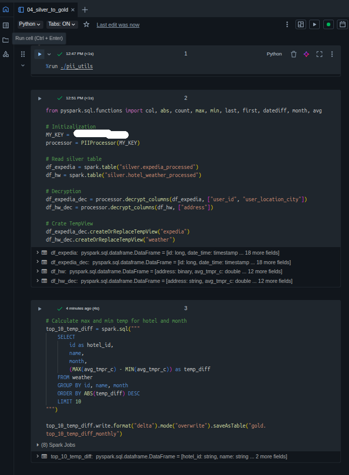
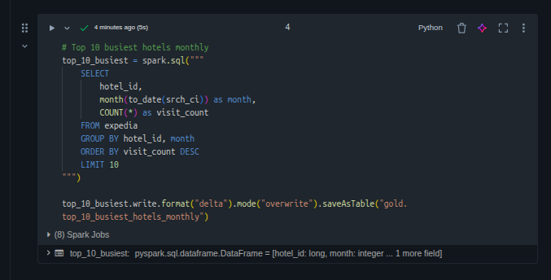
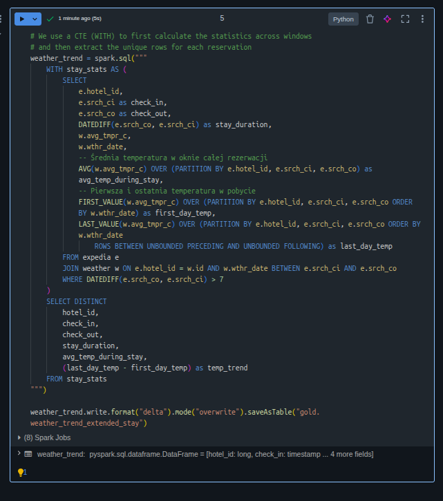
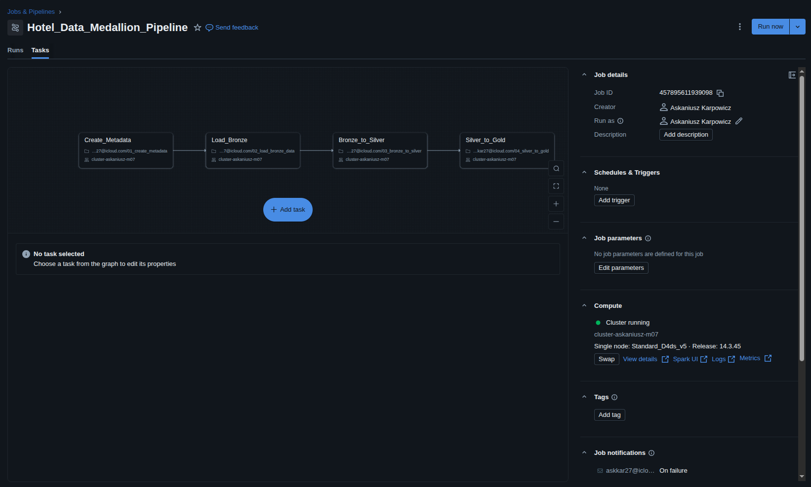
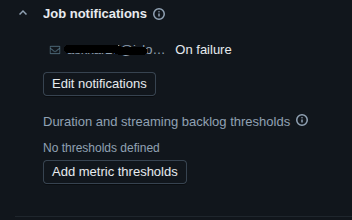
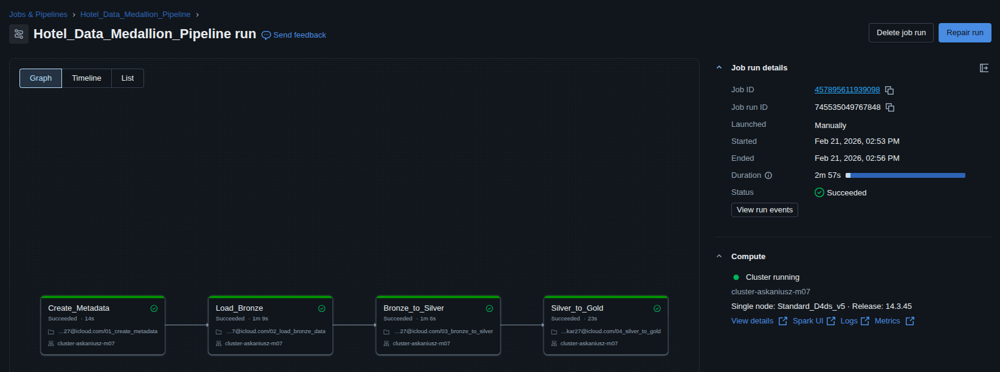
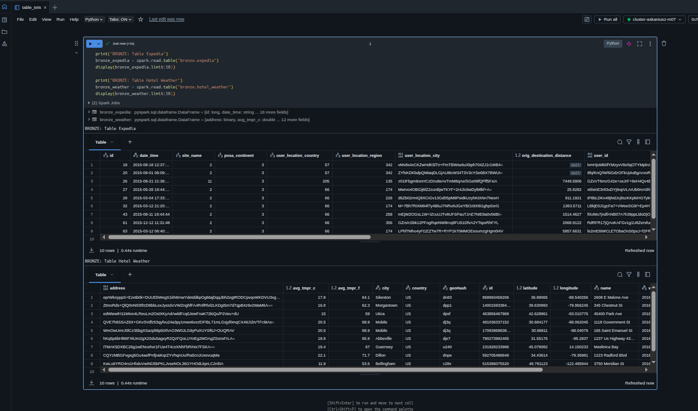
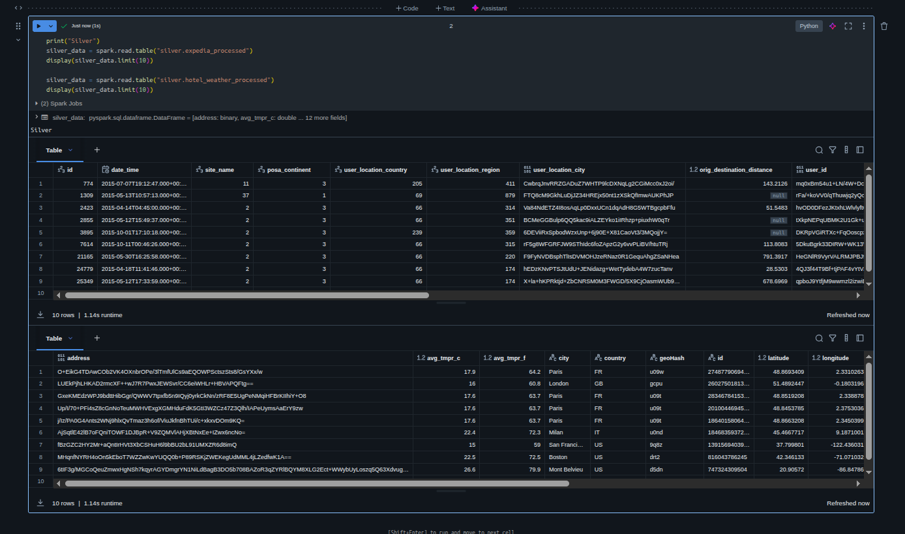
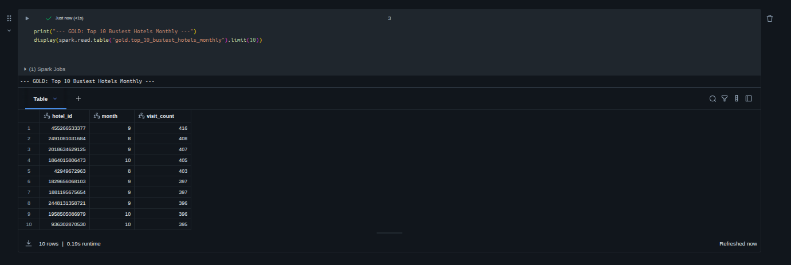
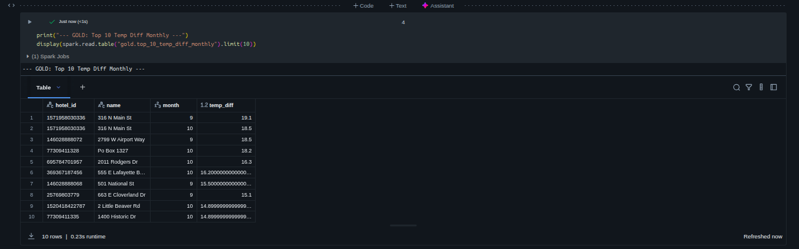
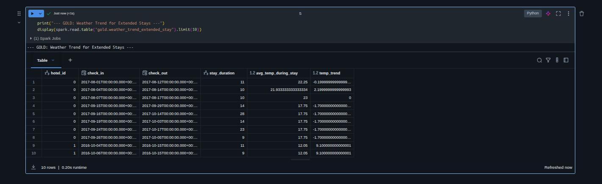


## 7. Destroy Infrastructure (Required Step)

After completing all steps, **destroy the infrastructure** to clean up all deployed resources.

⚠️ **Warning:** This action is **irreversible**. Running the command below will **delete all infrastructure components** created in previous steps.

To remove all deployed resources, run:

```bash
terraform destroy
```
